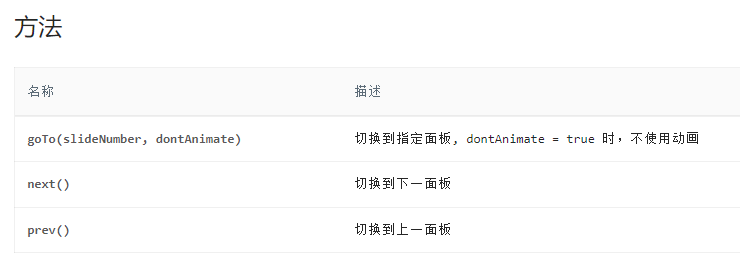

# CommonStore 通用 Store

`@orca-fe/pocket@1.22.0`

`CommonStore` 是一个组件与父组件`交互`的解决方案的基类。你可以基于 `CommonStore` 构建你自己的组件的`交互`方案。

## 背景

我们都知道，`React` 组件的内部，可通过 `状态(state)` 控制组件的渲染。而如果希望父组件也能控制子组件的渲染内容，一般会通过 `属性(props)` 来传递用于控制渲染的值。

`React` 的这种渲染机制，会让我们在进行一些组件交互的操作时产生困扰。举个简单的例子：[antd 走马灯](https://4x.ant.design/components/carousel-cn/)。

走马灯组件的“当前项”属性，用于控制当前展示第几项内容。但是外部组件，也有修改“当前项”的需求，则需要通过 `props` 将属性暴露出去。而我们需要这样书写：

```tsx | pure
import React from 'react';
import { Button, Carousel } from 'antd';

export default () => {
  // 假设 Carousel 暴露了属性 index
  const [index, setIndex] = useState(0);

  return (
    <div>
      <Carousel index={index} onIndexChange={setIndex} />
      <Button
        onClick={() => {
          setIndex(index - 1);
        }}
      >
        上一项
      </Button>
      <Button
        onClick={() => {
          setIndex(index + 1);
        }}
      >
        下一项
      </Button>
    </div>
  );
};
```

上面这个案例存在几个问题：

1. 父组件需要维护 `index` 状态，而这个状态除了走马灯组件，其它地方并不需要。
2. 因为`属性受控`的特点，走马灯组件的定时器等内部需要修改状态的操作，就需要触发事件 `onIndexChange` 来请求属性的变化。否则 `index` 属性会以 `props` 为最优先，导致组件内部无法再控制 `index`。
3. 仅仅是状态变化，没有考虑到属性的范围，无法对 `index` 做约束。比如走马灯只有 4 项，那么 `index` 的范围应该是 0~3，但上面的代码会导致 `index` 超出这个范围，难道要把走马灯的功能逻辑在外面也实现一次吗？

`antd` 的方案：

`antd` 在走马灯组件的 `ref` 上暴露了几个方法，用于操作内部的 `index` 状态，以此替代将 `index` 自身暴露出去。



> 但是，这种方案就需要你使用 useRef 来与组件产生联系。
> 我个人是不喜欢 React 的 ref 的，我只有在获取原生节点(如 div, canvas)才会使用 ref。
> 在 TypeScript 中，你还需要找到组件对外暴露的 ref type。在使用时还要使用 ref.current，还需要进行非空校验，真的很难受。

### antd 表单

如果你对 `antd` 的表单比较熟悉，你就知道，表单组件也有这个难题，并且表单组件的问题更加复杂：

- 表单组件需要随时随地取到最新的表单值 `form.getFieldValue`
- 表单的值，可以由用户输入，也可以由 API 修改 `form.setFieldValue`
- 表单的值发生变化，可以在函数组件中通过 hooks 监听到 `useWatch`
- 多表单联动 [链接](https://4x.ant.design/components/form-cn/#components-form-demo-form-context)

上面的情况，你还能依靠 `ref` 暴露方法来实现么？

## CommonStore 的解决方案

首先，我是比较喜欢 `antd 表单` 的解决方案的，直观，灵活。但如果你想去学习一下他的[源码](https://github.com/react-component/field-form)，可能会被劝退，表单的功能逻辑还是比较复杂的。

所以我想实现一个最简单的方案，能够实现类似 `antd 表单` 的操作风格即可。

请查看下方计数器组件实现的交互方案(建议查看 `Counter.tsx` 和 `CounterStore.ts` 的实现):

<code src="./demo/Demo1.tsx" ></code>

## API

### getState 获取当前最新的状态

`getState(): T`

可以在任意函数中获取最新状态，类似 `form.getFieldsValue`。

```ts | pure
const commonStore = useStore();

const state = commonStore.getState();
```

### useState 在函数组件中订阅最新状态

`useState(callback?: (state: T) => SubState ): SubState`

只能在函数组件中使用，且状态变化后，会触发组件重新渲染。

如果你仅在组件中使用上面的 `getState` 获取状态，`store` 发生变化时可能不会触发组件渲染。

```tsx | pure
import React from 'react';

export default () => {
  const store = useStore();

  // 获取 store 的状态
  const state = store.useState();

  // 可传入 callback 进行状态筛选，可进行性能优化，只有筛选后的状态发生变化，才重新渲染组件
  const { value } = store.useState((state) => ({ value: state.value }));

  return <div></div>;
};
```

### useStateChangedListener 状态变化监听

`useStateChangedListener(callback: (prevState: T, state: T) => void)`

在函数组件里监听状态的变化。监听不会导致组件重新渲染。

### useEventListener 事件监听器

`useEventListener(eventName: string, callback: (...args: any[]) => void)`

仅用作二次开发时，在组件内部监听更多事件使用。

### setState 更新状态

`setState(state: Partial<T>)`

仅用作二次开发时，更新状态使用。
