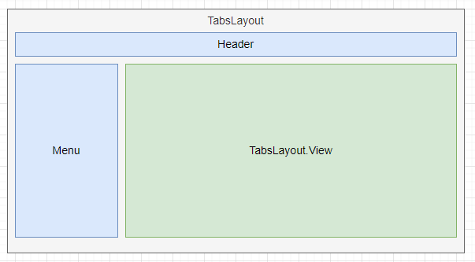

# TabsLayout 多页签布局

`@orca-fe/pocket@1.15.0`

适用于传统中后台的多页签布局。

## 示例

<code src="./demo/Demo1.tsx"></code>

<code src="./demo/Demo2.tsx"></code>

<code src="./demo/Demo3.tsx"></code>

## API

### TabsLayout

`TabsLayout` 就是一个 `div` 你可以将它视为一个 `div` 来使用，它具备 `div` 的所有属性和下面这些额外的属性。

| 属性         | 说明                                  | 类型           | 默认值      |
| ------------ | ------------------------------------- | -------------- | ----------- |
| emptyContent | 当没有添加任何页签时所展示的内容      | `ReactElement` | `undefined` |
| tabsProps    | 其他需要传递给 `antd-Tabs` 组件的属性 | `TabsProps`    | -           |

### TabsLayout.View

`TabsLayout.View` 作为 `Tabs` 的挂载点，本身也是一个 `div` 具备 `div` 的所有特性。

**在 `TabsLayout` 内部，必须有且只有一个 `TabsLayout.View`。**

上面的基础用法已经阐述了如何使用它们。

### TabsLayoutContext

在 `TabsLayout` 内部，你可以通过 `TabsLayoutContext` 操作页签。

```tsx | pure
// 单个tab配置
type TabConfigType = {
  // tabs 的标识符
  key: string;
  // tabs 标题
  title: React.ReactNode;
  // 内容
  content: React.ReactNode;
  // 当前 Tab 特有的参数
  params?: unknown;
  // 关闭事件
  onClose?: () => void;
  // 指定 Tab 的顺序，默认按照数组下标的顺序
  order?: number;
};

// Tab 操作句柄
type TabsLayoutContextType = {
  // 当前 Tabs 的配置
  tabs: TabConfigType[];
  // 直接更新 Tabs 配置（一般比较少用，可用于一键恢复所有页签的场景）
  setTabs: (tabs: TabConfigType[]) => void;
  // 添加 Tab
  add: (tabConfig: TabConfigType, active?: boolean) => void;
  // 更新 Tab 信息
  update: (tabConfig: Partial<TabConfigType> & { key: string }) => void;
  // 关闭 Tab
  remove: (key: string) => void;
  // 当前激活的 Tab
  activeKey: string;
  // 激活某个 Tab
  active: (key: string, force?: boolean) => void;
};

import { TabsLayoutContext } from '@orca-fe/pocket';
// 使用下面的方式，获取 Tabs 操作句柄。
const tab: TabsLayoutContextType = useContext(TabsLayoutContext);

// 添加页签
tab.add({
  key: 'tab1',
  title: 'Tab1',
  content: <MyContent></MyContent>,
  params: { arg1: 123, arg2: 'abc' },
});
```

### TabConfigContext

在某个页签的内部，你可以通过 `TabConfigContext` 获取到当前页签的信息，并操作页签。比如上面的 `<MyContent></MyContent>` 组件内部。

```tsx | pure
type TabConfigContextType = {
  // 当前页签的数组下标
  index: number;
  // 当前页签的配置信息
  current: TabConfigType | null;
  // 当前页签是否处于激活状态
  isActive: boolean;
  // 激活当前页签
  active: () => void;
  // 关闭当前页签
  close: () => void;
  // 更新当前页签的配置
  update: (tabConfig: Omit<TabConfigType, 'key'>) => void;
  // 获得当前页签的参数
  params: unknown;
};

// 使用下面的方式，获取当前 tab 的信息
const currentTab: TabConfigContextType = useContext(TabConfigContext);
```

### useTabCloseListener

在当前页签内部，监听页签的关闭事件。

```ts | pure
import { useTabCloseListener } from '@orca-fe/pocket';

// 在函数组件内部。
useTabCloseListener(async () => {
  const feedback = await doSomething();
  if (feedback) {
    return true;
  }
  // 禁止关闭
  return false;
});
```

## FAQ

### 为什么要用 TabsLayout + TabsLayout.View 的结构



这是一个常见的 `Tabs 布局`。

首先，`TabsLayout` 本身只是对 `antd` 的 `Tabs` 组件的封装。而作为 `React` 组件，要利用 `Tabs` 完成业务逻辑，我们只能通过修改状态，来实现 `Tabs` 的增删和切换。

同时，这样一个状态，必须是共享的、全局的，我不可能只在一个组件中完成 `tabs` 的所有动作。
比如我点击菜单时，需要打开新的 `Tab`，在 `Tab` 内部，完成操作后，自动关闭当前 `Tab`，又或者跳转到另一个 `Tab`。
于是这个布局就会显得由为庞大笨重，你想要在新项目去使用？必须带着一个 `redux` 或什么状态管理器。
特别是不同的项目下，菜单结构、Header 结构可能都略有不同，布局也要不断地定制。

怎么才能将 `Tabs` 这个组件的动作抽象出来，是不是可以使页面结构解耦，变得更为清晰呢。

我的诉求很简单，我希望当我添加新的 `Tab` 的时候，可以直接调用 `tab.add(xxx)` 而不是 `dispatch({ type:"setTabs", tabs: xxx })`，
当我想要在某处切换 `Tab` 的时候，我希望直接调用 `tab.active(xxx)` 而不是 `dispatch({ type:"setCurrent", payload: 1 })`。

利用 `Context` 的特性，所有在 `TabsLayout` 内部的组件，都可以通过 `TabsLayoutContext` 来操作 `Tab` 的内容，增加删除或切换。
而 `TabsLayout.View` 则是用于标记渲染 `Tabs` 的位置。
所以整个结构就像上面图中展示的那样，`TabsLayout` 通常在最外层，为整个页面提供了操作页签的能力，内部包裹着你的页面基础布局，包括 Header、菜单等，然后在合适的地方，渲染 `TabsLayout.View`。

这样，你的布局可以非常灵活，你想把菜单放在右侧？没问题，改一下它和 `TabsLayout.View` 的位置就可以了。同时在页面的任何地方，都可以操作 `Tab`，只要 `useContext` 就行了。
